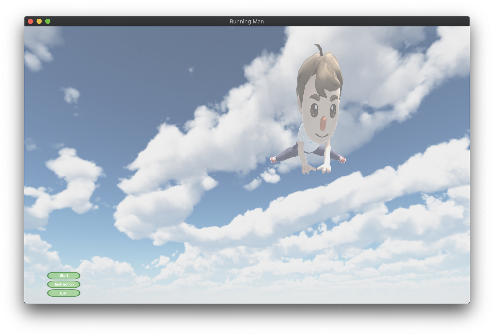
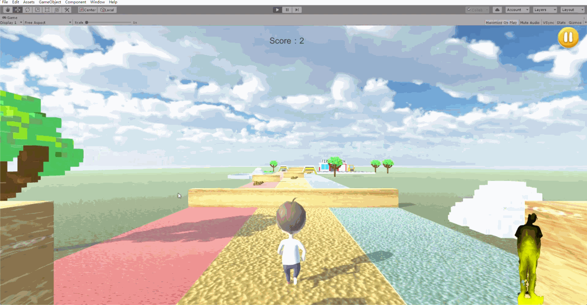
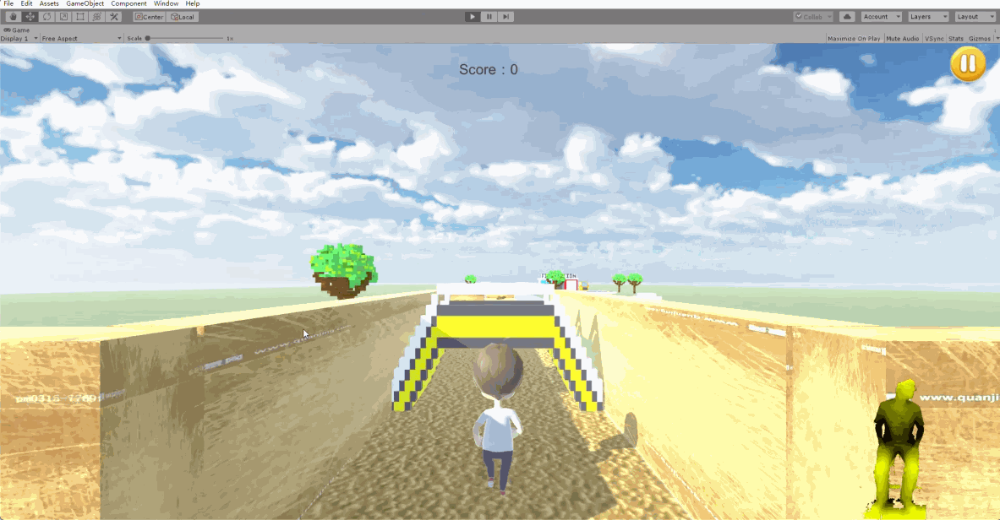
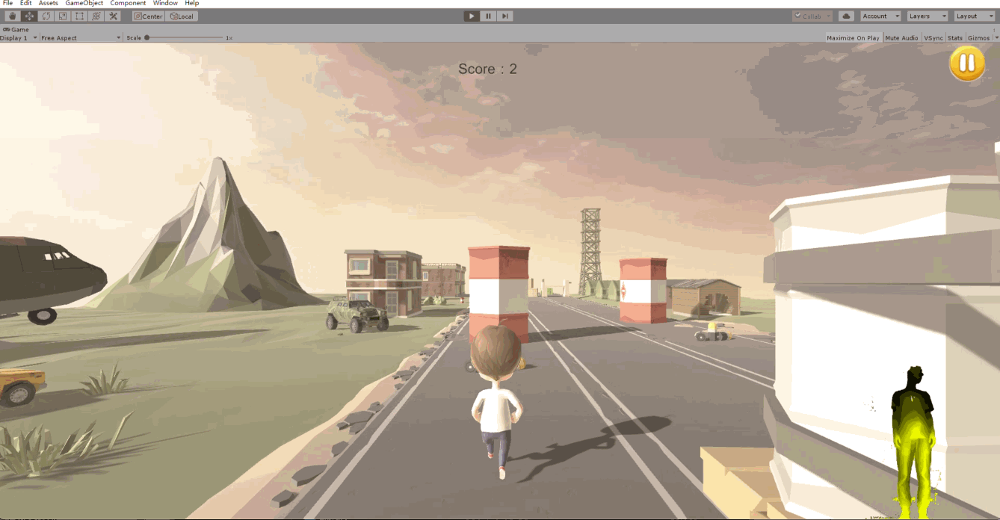
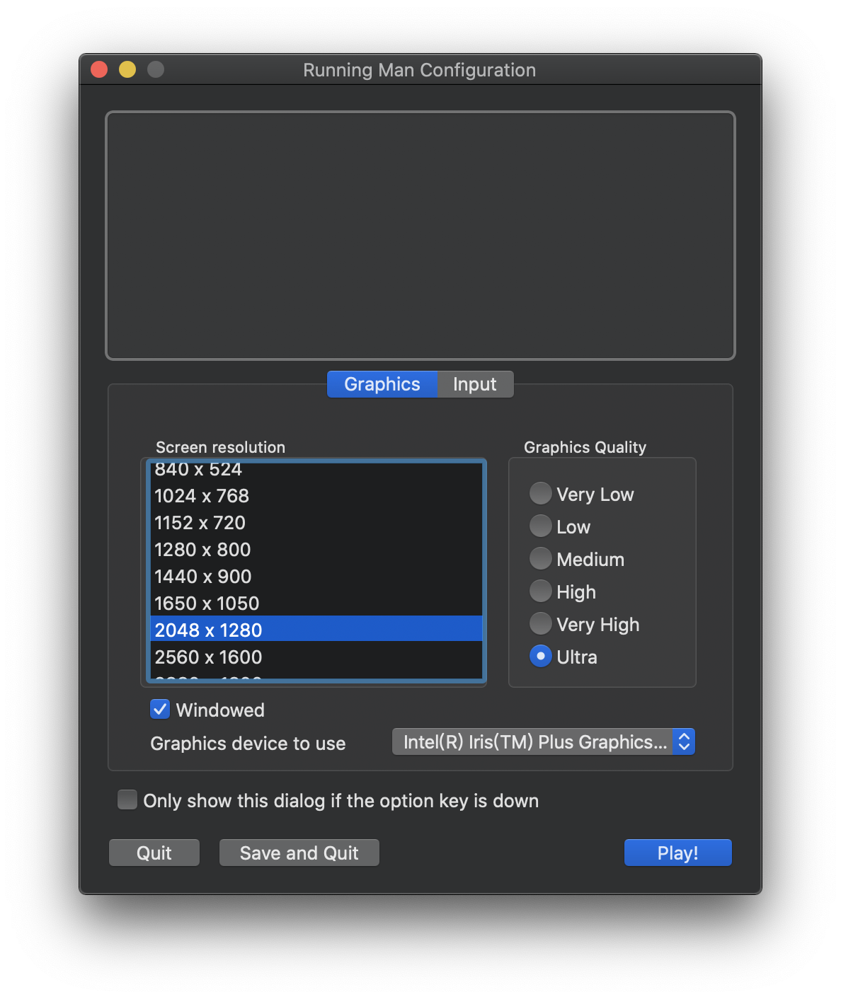

 

# Endless Runner: Border Escape

    
     
    
    
    

A 3D Somatosensory Game based on **Unity 3D** and **Kinect 2.0**.  Different types of input devices are supported to enhance the game experience, including *Kinect*, Keyboard, and Mouse. (Each contained in a different branch)

## Game Logic and Functionality

- **Start Panel**
  
  - **View information**
    - Click `information` button with a mouse to view the information of the developers of the game.
    - Or you can attempt to make a gesture of `ZoomIn` (Elbows down, palms at least 0.7 meters apart, and then slowly close palms together) before the *Kinect* camera, then the information panel is displayed.
    - If you want to return to the main page, then either try to click the `close` button, or to make a gesture of `ZoomOut` (Elbows down, fold both palms together, and then slowly separate them) before the *Kinect* camera.
  - **Two ways to launch the game:**
    - Move your mouse and click the `start` button to start the game with keyboard as the input device.
    - In the lower right corner of the interface, if a *Kinect* is linked to the computer, then there will appear a Character Texture Map, which displays the player's action. Run in the spot before the *Kinect* camera, once the *Kinect* identifies your actions, the game starts with *Kinect* as the input device.
  - **Quit the game:**
    - Click the `Exit` button and then quit the game.
    - Make a gesture of `Wave` (Straighten your right/left arm forward, and then wave your right/left arm) before the *Kinect* camera.
  
  
  
- **Main Scene**

  - **Jump**

    - In keyboard mode, player can use the space bar to control the character to jump. Player cannot jump over some high barriers.
    - In *Kinect* mode, player can jump on the spot to control jump, making sure that the *Kinect* can detect your knee bending.

    

  - **Squat**

    - In keyboard mode, player can use the down arrow key ⬇️ to control the character to squat.
    - In *Kinect* mode, player can make a gesture of squat to control squat.

    

  - **Move**

    - In keyboard mode, player can use the left arrow key ⬅️ or right arrow key ➡️ to control the character to move to the left/right.
    - In *Kinect* mode, player can make a gesture of waving to the left/right to control the movement of the character.

    

  - **Restart**

    - In keyboard mode, once the player fails, he can use the mouse to click the `restart` button to restart the game.
    - In *Kinect* mode, player can make a gesture of wave to restart the game.

    

  - **Pause**

    - In keyboard mode, player can click the pause button in the upper left corner to pause the game.
    - In *Kinect* mode, player can raise his hands to pause the game.

    

## Installation and Usage

This game does not need to be installed. Player can download the [released version](https://github.com/154544017/BorderEscape/releases) (`BorderEscape_macOS.dmg` for macOS and `BorderEscape_win_64bits.rar` for Windows 10), unzip the corresponding file, and launch the game by double click on the executable file.

Then fill the game configuration, choose the screen resolution, graph quality, and whether windowed. At last, you can click `Play!` to start the game.

It is suggested to set the Sreen resolution to `1650 x 1050` or `2048 x 1280`.

Unfortunately, the macOS version do not support *Kinect* at present.

## Report

If you are interested in the implementation details of the project, see [Report](Report.md).

## Contribution

See [Contribution](https://github.com/154544017/BorderEscape/graphs/contributors).

## License

This project is open source licensed under the Apache 2.0 License. Please see the [LICENSE file](LICENSE) for more information.
